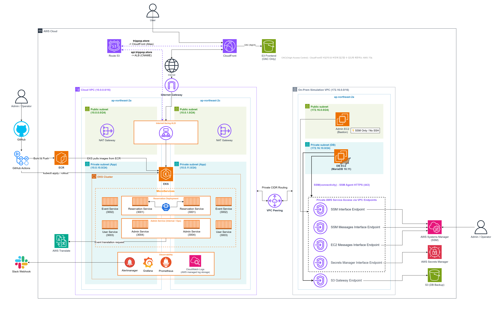

# 외국인 팝업스토어 예약 플랫폼 "TripPop"

**TripPop**은 외국인 관광객을 위한 K-컬처 팝업스토어 예약 플랫폼입니다. 사용자는 영어 등 선호 언어로 팝업스토어 이벤트를 조회하고 예약할 수 있으며, 운영자는 관리자 기능으로 이벤트와 예약 데이터를 관리합니다.

## 기획 배경

한국 팝업스토어와 문화 체험은 외국인 관광객의 관심이 높지만, 실제 예약 과정에서는 언어 장벽, 현장 대기, 분산된 정보 탐색 비용이 큽니다. TripPop은 이 문제를 예약 도메인으로 좁히고, 이벤트 조회부터 예약 생성까지의 흐름을 MSA와 클라우드 인프라 위에서 구현한 팀 프로젝트입니다.

> 이 저장소는 TripPop 팀 프로젝트의 포트폴리오 공개용 스냅샷입니다.
> 실제 협업은 별도 Team/Private 저장소에서 진행했습니다.

## Team

| 이름 | GitHub | 담당 영역 |
| --- | --- | --- |
| 이성호 | [@github-placeholder-sungho](https://github.com/github-placeholder-sungho) | 네트워크, VPC, Terraform, 인프라 설계 |
| 성지수 | [@github-placeholder-jisu](https://github.com/github-placeholder-jisu) | PM, 모니터링, 비용, 운영 |
| 김건호 | [@github-placeholder-geonho](https://github.com/github-placeholder-geonho) | EKS, Kubernetes, 예약 서비스 |
| 김재백 | [@github-placeholder-jaebaek](https://github.com/github-placeholder-jaebaek) | 이벤트/관리자 서비스, 다국어 |
| 김채아 | [@github-placeholder-chaeah](https://github.com/github-placeholder-chaeah) | CI/CD, 프론트엔드 |
| 이창하 | [@github-placeholder-changha](https://github.com/github-placeholder-changha) | DB, IAM, 보안 |

## What We Built

| 기능 | 설명 |
| --- | --- |
| 사용자 인증 | 회원가입, 로그인, token 기반 인증 |
| 이벤트 조회 | 팝업스토어 목록/상세/슬롯 조회 |
| 예약 생성 | 멱등성 키, 낙관적 잠금, DB UNIQUE 제약을 사용한 중복 예약 방지 |
| 관리자 운영 | 이벤트 등록, 슬롯 생성, 다국어 번역 데이터 생성 |
| 다국어 지원 | AWS Translate 또는 mock provider 기반 번역 fallback |
| 이미지/프론트 배포 | S3/CloudFront 기반 정적 배포와 이미지 저장 |
| 운영 자동화 | GitHub Actions CD, EKS 배포, Route 53 API 도메인 갱신 |

## Architecture



```text
Cloud VPC
├─ ALB / Route 53 / CloudFront
├─ EKS private node group
│  ├─ reservation-service
│  ├─ event-service
│  ├─ user-service
│  └─ admin-service
└─ NAT Gateway

VPC Peering

On-Prem Simulation VPC
├─ Admin EC2 (SSM 기반 베스천)
├─ DB EC2 (Docker MariaDB 10.11)
└─ VPC Endpoints (SSM, Secrets Manager, S3)
```

## 서비스 목록

| 서비스 | 포트 | 책임 | 오너 |
| --- | ---: | --- | --- |
| `reservation-service` | 3001 | 예약 생성, 멱등성, 동시성 제어 | 김건호 |
| `event-service` | 3002 | 이벤트 목록/상세/슬롯 조회 | 김재백 |
| `user-service` | 3003 | 회원가입, 로그인, token 인증 | 김재백 |
| `admin-service` | 3004 | 이벤트 등록, 번역, 관리자 예약 | 김재백 |

## 기술 스택

| 영역 | 기술 |
| --- | --- |
| Backend | Node.js 22, Express |
| Database | MariaDB 10.11 on EC2, Docker |
| DB Client | `mysql2/promise` Pool |
| Infrastructure | Terraform, AWS VPC, EKS, EC2, ECR, S3, CloudFront, Route 53 |
| Kubernetes | EKS 1.34, Deployment, Service, Ingress, HPA |
| CI/CD | GitHub Actions, OIDC, ECR, kustomize, kubectl |
| Network | Cloud VPC + On-Prem Simulation VPC, VPC Peering, SG reference |

## Technical Highlights

### 1. 하이브리드 MSA 인프라

애플리케이션은 Cloud VPC의 EKS에 배포하고, DB는 On-Prem Simulation VPC의 EC2에서 Docker MariaDB로 운영했습니다. 두 VPC는 VPC Peering으로 연결했으며, DB 접근은 EKS Node SG와 Admin EC2 SG로 제한했습니다.

### 2. 예약 동시성 제어

예약 생성은 단순 INSERT가 아니라 아래 방어선을 함께 거칩니다.

```text
Idempotency-Key
-> remaining_capacity 조건부 UPDATE
-> version 기반 낙관적 잠금
-> UNIQUE(user_id, event_slot_id)
-> UNIQUE(idempotency_key)
-> 단일 트랜잭션
```

### 3. Terraform 모듈화와 운영 통제

VPC, Peering, EKS, IAM, EC2 DB, ECR, S3, Monitoring을 모듈로 분리했습니다. Apply는 지정 담당자가 수행하며, SG/IAM/DB 변경은 오너 승인 후 반영합니다.

### 4. 비용 관리

학습용 AWS 예산 안에서 운영하기 위해 EKS Cluster와 Cloud NAT Gateway는 필요한 시간에만 켜고 끄는 절차를 두었습니다. On-Prem DB VPC는 초기 세팅 때만 NAT Gateway를 사용하고, 이후에는 VPC Endpoint로 비용을 줄였습니다.

## Repository Map

```text
services/                 # Node.js microservices
k8s/base/                 # Kubernetes manifests
infra/envs/team-dev/      # Terraform root environment
infra/modules/            # Terraform modules
scripts/                  # DB/init/ops scripts
k6/                       # load test scenarios
docs/                     # GitHub 공개/팀 온보딩 문서
```

## 목차

| 문서 | 읽는 사람 | 내용 |
| --- | --- | --- |
| [프로젝트 개요](docs/01-project-overview.md) | 외부인, 신규 팀원 | 문제, 아키텍처, 역할, 핵심 설계 |
| [팀 규칙](docs/02-team-rules.md) | 전 팀원 | 네이밍, 브랜치, 보안, 작업 원칙 |
| [서비스/API/DB 계약](docs/03-service-api-contracts.md) | 프론트/백엔드/DB | API 요청/응답, 오너, DB 스키마 |
| [인프라/Terraform 가이드](docs/04-infra-terraform-guide.md) | 인프라/모듈 오너 | 모듈 오너십, apply/destroy, IAM 통합 예시 |
| [Kubernetes/CD 가이드](docs/05-kubernetes-cicd-guide.md) | EKS/CD 담당 | manifest, Ingress, Secret, Route 53, CD 흐름 |
| [PR/테스트/트러블슈팅](docs/06-pr-testing-troubleshooting.md) | 모든 작업자 | PR 템플릿, 검증 명령, 장애 해석 |

## 작업 간 팀 규칙 요약

```text
1. 요청받은 범위만 작게 바꾼다.
2. API 필드명과 DB 컬럼명은 실제 코드와 SQL 기준으로 확인한다.
3. Terraform apply는 지정 담당자만 수행한다.
4. 민감값, token, 비밀번호, 개인 환경값은 Git에 커밋하지 않는다.
5. DB 접근은 SG ID 직접 참조를 우선한다.
6. Docker image tag latest는 사용하지 않는다.
7. 예약 생성 로직은 트랜잭션과 DB 제약을 반드시 유지한다.
```
